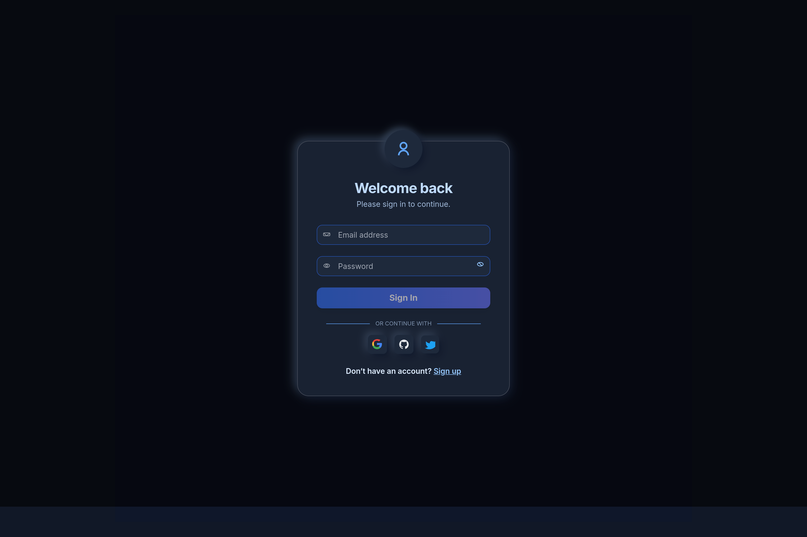
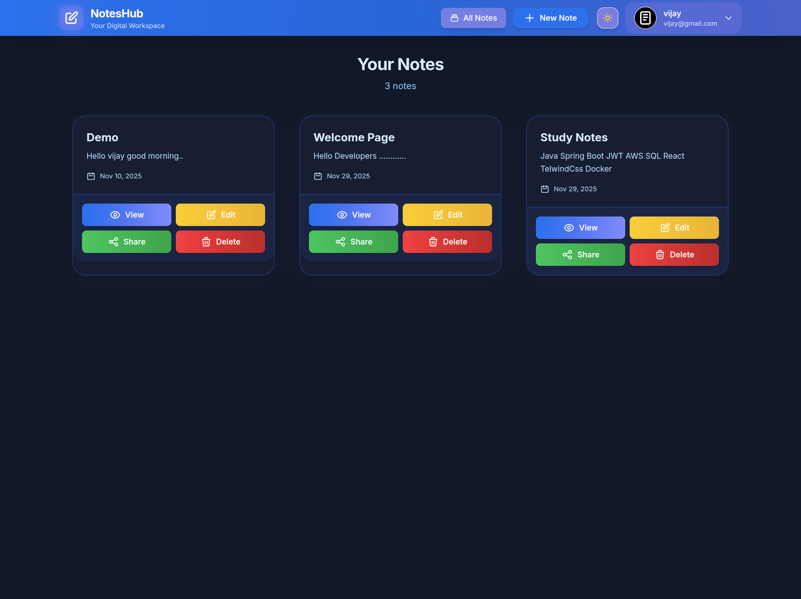
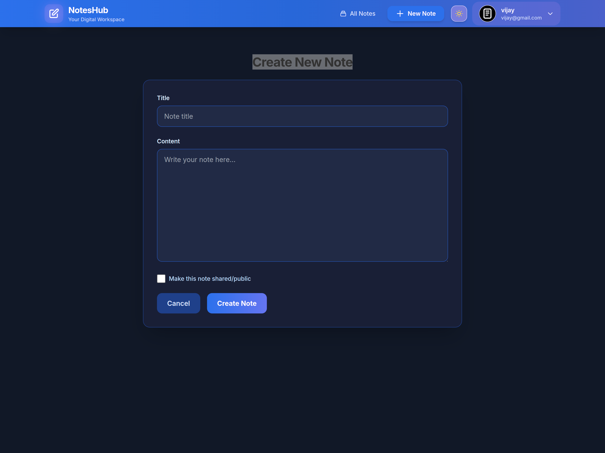
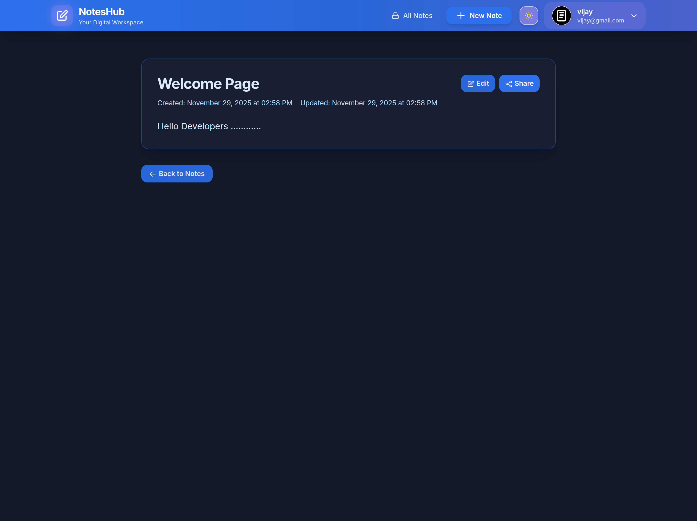
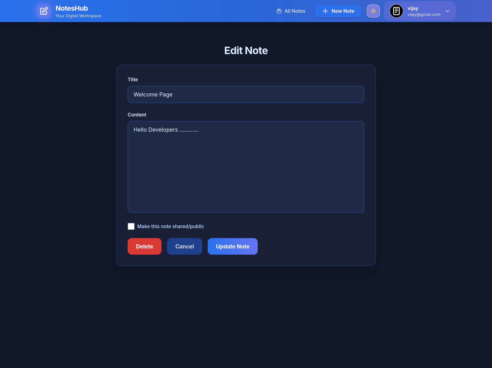
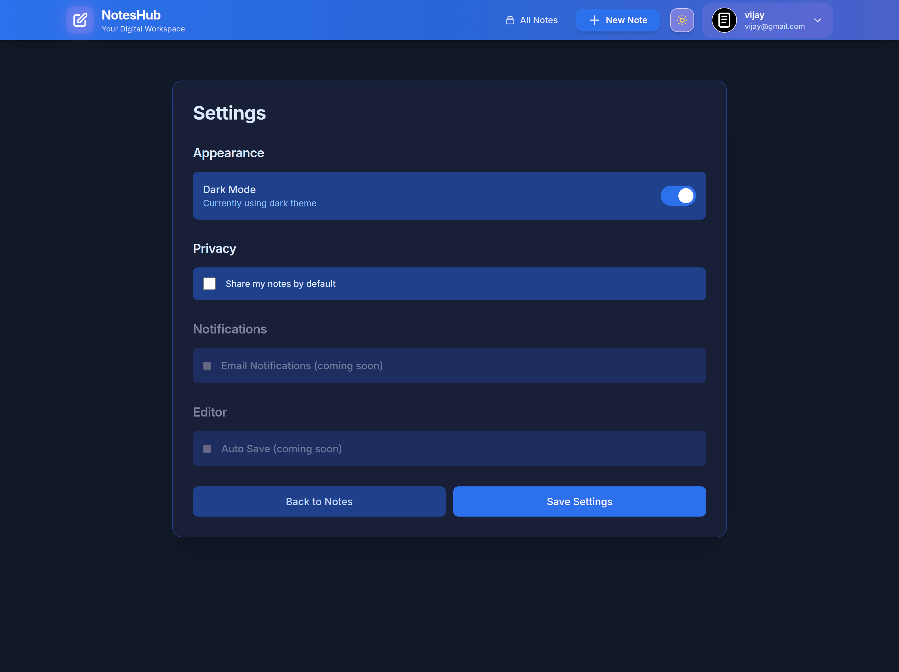
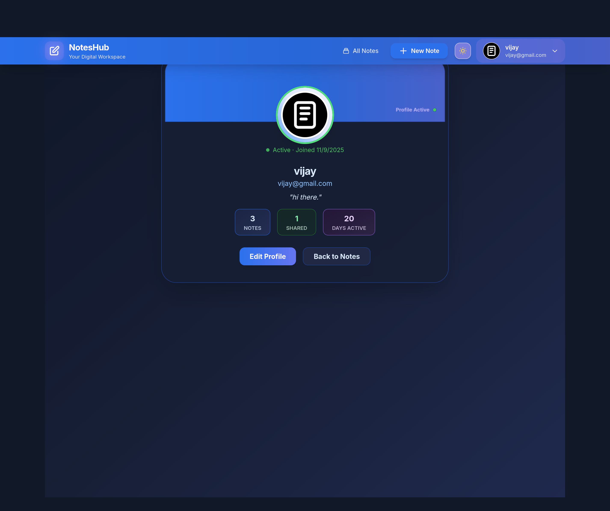
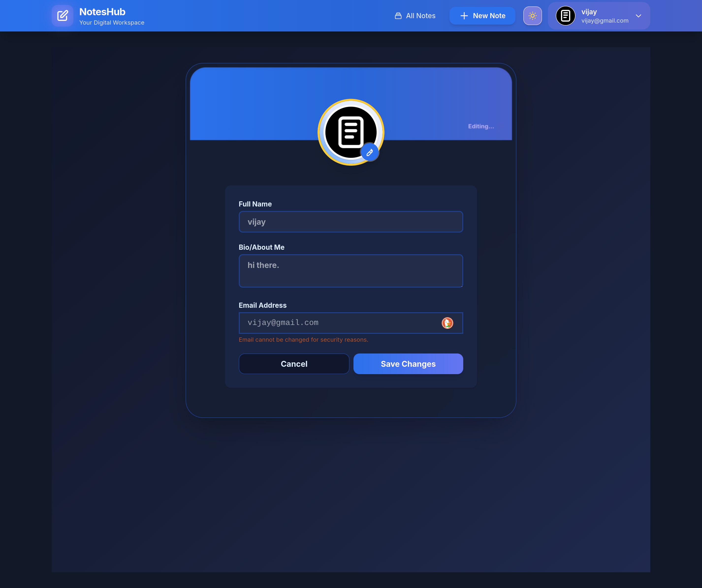
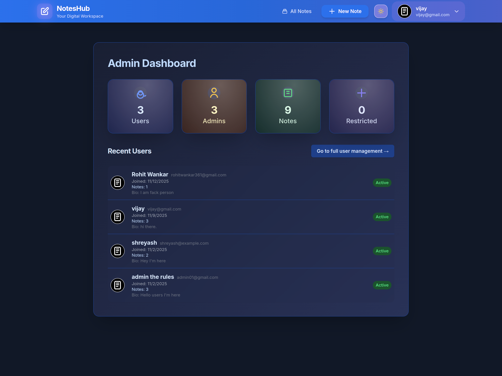

# Secure Notes Web Application
[](https://notes-app-net.netlify.app/)
[](https://www.java.com/)
[](https://spring.io/projects/spring-boot)
[](https://reactjs.org/)
[](https://tailwindcss.com/)
[](https://www.mysql.com/)

## About The Project

**Notes Web Application** is a secure, full-stack solution designed to manage personal notes efficiently. Built with a **Spring Boot** backend and a **React + Tailwind** frontend, this project demonstrates a robust implementation of RESTful APIs, secure authentication, and responsive design.

Key highlights include strict **JWT Authentication**, role-based access control (Admin vs User), and a clean, modern UI.

### Key Features
* **Secure Authentication:** User registration and login using JWT (JSON Web Tokens).
* **Data Security:** Passwords are encrypted using BCrypt before storage.
* **CRUD Operations:** Create, Read, Update, and Delete notes seamlessly.
* **Responsive UI:** Built with React and Tailwind CSS for mobile and desktop.
* **User Profile:** Edit profile details and manage account settings.
* **Admin Panel:** Special access for administrators to view system-wide statistics (if applicable).

---

## Tech Stack

| Component | Technology |
| :--- | :--- |
| **Backend** | Java, Spring Boot, Spring Security, Hibernate/JPA |
| **Frontend** | React.js, Vite, Tailwind CSS, Axios |
| **Database** | MySQL |
| **Security** | JWT, BCrypt Encoding |
| **Tools** | Maven, Git, Docker, Netlify (Frontend), Railway/Render (Backend) |

---

## Project Screenshots

| Login Page | Dashboard / Home |
| :---: | :---: |
|  |  |

| Create Note | View Note |
| :---: | :---: |
|  |  |

| Edit Note | Settings |
| :---: | :---: |
|  |  |

| User Profile | Edit Profile |
| :---: | :---: |
|  |  |

| Admin Dashboard |
| :---: | 
|  |  |
---

## Getting Started (Run Locally)

Follow these steps to set up the project locally on your machine.

### Prerequisites
* Java Development Kit (JDK 17+)
* Node.js & npm
* MySQL Server

### 1. Clone the Repository
```bash
git clone [https://github.com/techiviju/Notes-Application.git](https://github.com/techiviju/Notes-Application.git)
cd Notes-Application
````

### 2\. Backend Setup (Spring Boot)

1.  Navigate to the backend folder:
    ```bash
    cd notes_app_backend
    ```
2.  **Configure Database:** Open `src/main/resources/application.properties` and update your MySQL credentials:
    ```properties
    spring.datasource.url=jdbc:mysql://localhost:3306/notes_db
    spring.datasource.username=YOUR_USERNAME
    spring.datasource.password=YOUR_PASSWORD
    ```
3.  **Run the Application:**
    ```bash
    ./mvnw spring-boot:run
    ```
    *The backend server will start on `http://localhost:8080`*

### 3\. Frontend Setup (React)

1.  Open a new terminal and navigate to the frontend folder:
    ```bash
    cd note_app_frontend
    ```
2.  **Install Dependencies:**
    ```bash
    npm install
    ```
3.  **Run the Frontend:**
    ```bash
    npm run dev
    ```
    *The frontend will start on `http://localhost:5173` (or similar port).*

-----

## API Endpoints (Overview)

| Method | Endpoint | Description |
| :--- | :--- | :--- |
| `POST` | `/api/auth/register` | Register a new user |
| `POST` | `/api/auth/login` | Authenticate and get Token |
| `GET` | `/api/notes` | Get all notes for logged-in user |
| `POST` | `/api/notes` | Create a new note |
| `PUT` | `/api/notes/{id}` | Update a specific note |
| `DELETE` | `/api/notes/{id}` | Delete a specific note |

-----

## 🤝 Contact

**Vijay Chaudhari** (Full Stack Java Developer)

  * **GitHub:** [techiviju](https://www.google.com/search?q=https://github.com/techiviju)
  * **LinkedIn:** [LinkedIn Profile](https://www.linkedin.com/in/vijay-achaudhari/)
  * **Email:** vijaychaudhari5220@gmail.com
  * **Portfolio** [Porfolio](https://vijaychportfolio.netlify.app/)

-----

## 🌟 Show Your Support

If you like this project or find it helpful, please give it a **Star**! ⭐️

1. Click the **Star** button at the top right of this page.
2. Fork the repository to experiment with the code.

Your support motivates me to build more cool projects! 🚀
=======